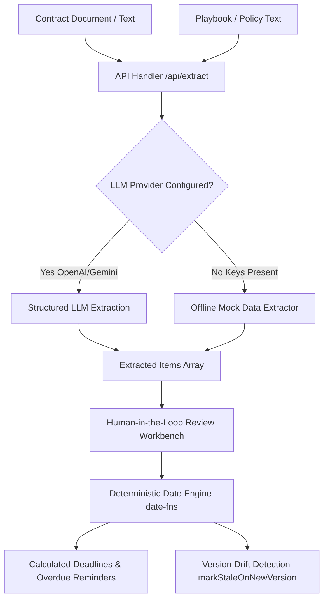

# Contract Obligation & Renewal Assistant

A Next.js (App Router, TypeScript, Tailwind CSS) application designed for intelligent contract field extraction, human-in-the-loop review, and deterministic obligation date arithmetic.

---

## 📋 Table of Contents

- [Overview](#overview)
- [Architecture & Key Concepts](#architecture--key-concepts)
- [Features](#features)
- [Project Structure](#project-structure)
- [Setup & Commands](#setup--commands)
- [Deterministic Date Engine Logic](#deterministic-date-engine-logic)
- [Legal Disclaimer & Responsible AI](#legal-disclaimer--responsible-ai)

---

## 🎯 Overview

Contracts contain critical deadlines, notice periods, and operational obligations buried within legal prose. Relying solely on Generative AI for calendar date calculations risks math hallucinations, missing leap year boundary conditions, or miscalculating notice offsets.

The **Contract Obligation & Renewal Assistant** solves this by enforcing a separation of concerns:
1. **AI Extraction**: LLMs (OpenAI GPT-4o-mini or Google Gemini 2.0 Flash, with an offline mock fallback) extract structured entities, verbatim quotes, and certainty levels.
2. **Human-in-the-Loop (HITL) Review Workbench**: Legal/Ops personnel review, edit, approve, or reject extracted fields, as well as respond to AI-generated clarification questions.
3. **Deterministic Date Engine**: Core calendar calculations (reminder dates, notice windows, overdue checks) are executed using pure, deterministic JavaScript date arithmetic via `date-fns`.

---

## 🏗️ Architecture & Key Concepts



### Key Architectural Layers

- **App Router UI (`src/app/page.tsx`, `src/components/`)**: Interactive workbench interface featuring dual-pane document viewing, extraction reviews, status tagging, inline editing, and deadline summaries.
- **Extraction Handler (`src/app/api/extract/route.ts`, `src/lib/extractor.ts`)**: Validates input payloads using Zod schemas, communicates with LLM APIs using structured outputs (JSON schema), and falls back seamlessly to deterministic mock data when API keys are not supplied.
- **Deterministic Engine (`src/lib/deterministic-engine.ts`)**: Pure utility functions handling ISO 8601 calendar calculations, notice offset subtractions, leap year precision, and contract version drift tracking.
- **Type Definitions (`src/types/contract.ts`)**: Domain models for extracted items, contract versions, obligation reminders, and summary metrics.

---

## ✨ Features

- 🔍 **Structured Contract Extraction**: Extracts parties, effective dates, expiry dates, renewal terms, termination rules, notice periods, and obligations.
- 🛡️ **Grounding & Citation**: Every extracted item includes a verbatim `sourceSection` quote from the underlying contract text for rapid verification.
- ❓ **Certainty & Clarification**: Flags ambiguous text as `uncertain` and prompts human reviewers with explicit clarification questions.
- ✏️ **Human-in-the-Loop Workbench**: Interactive interface allowing reviewers to approve, edit, or reject items.
- 🔄 **Version Drift Detection**: When a new contract document version is uploaded, previously approved items are automatically flagged as `stale` to trigger re-verification.
- 📅 **Deterministic Reminders**: Automatically computes exact notice reminder dates (`Expiry Date - Notice Days`) using `date-fns`.
- 🌐 **Offline First / Mock Fallback**: Fully usable without external API dependencies.

---

## 📁 Project Structure

```
contract-assistant/
├── src/
│   ├── app/
│   │   ├── api/
│   │   │   └── extract/
│   │   │       └── route.ts             # POST extraction API route
│   │   ├── globals.css                  # Global Tailwind CSS styling
│   │   ├── layout.tsx                   # Next.js root layout
│   │   └── page.tsx                     # Main application page
│   ├── components/
│   │   ├── ContractAssistantApp.tsx     # Full workbench application shell
│   │   ├── ContractWorkbench.tsx        # Split-pane review & reminder workbench
│   │   ├── ContractViewer.tsx           # Contract document viewer
│   │   ├── DeadlinesReminders.tsx       # Calculated reminders list
│   │   ├── ExtractionReview.tsx         # Item review list with inline edit & approvals
│   │   ├── InputForm.tsx                # Contract & policy input controls
│   │   ├── SummaryCard.tsx              # Executive summary & legal audit box
│   │   ├── ToastViewport.tsx            # Floating toast notification viewport
│   │   └── TopBanner.tsx                # Legal notice & version drift controls
│   ├── lib/
│   │   ├── __tests__/
│   │   │   └── deterministic-engine.test.ts # Vitest unit tests (100% passing)
│   │   ├── deterministic-engine.ts      # Pure calendar date math & version drift logic
│   │   ├── extractor.ts                 # LLM schema validation & fallback extractor
│   │   ├── sample-contract.ts           # Built-in sample contract text
│   │   └── utils.ts                     # UI utility functions (clsx/tailwind-merge)
│   └── types/
│       └── contract.ts                  # TypeScript interfaces & types
├── vitest.config.ts                     # Vitest test runner configuration
├── package.json                         # Scripts and dependencies
└── README.md                            # Documentation
```

---

## 🛠️ Setup & Commands

### Prerequisites

- **Node.js**: `v18.x` or higher
- **npm**: `v9.x` or higher

### 1. Installation

Install project dependencies:

```bash
npm install
```

### 2. Environment Variables (Optional)

To connect real LLM providers, create a `.env.local` file in the root directory:

```env
# OpenAI Configuration
OPENAI_API_KEY=your_openai_api_key
OPENAI_MODEL=gpt-4o-mini

# OR Google Gemini Configuration
GEMINI_API_KEY=your_gemini_api_key
GEMINI_MODEL=gemini-2.0-flash
```

> **Note:** If no API key is set, the application operates in **offline mode**, utilizing realistic mock extraction data.

### 3. Development Server

Start the Next.js local development server:

```bash
npm run dev
```

Open [http://localhost:3000](http://localhost:3000) in your browser to interact with the application.

### 4. Running Unit Tests

Run the Vitest unit test suite:

```bash
npm test
```

### 5. Code Linting

Run ESLint to verify code quality:

```bash
npm run lint
```

### 6. Production Build

Validate TypeScript types and compile the Next.js production build:

```bash
npm run build
```

---

## 🧮 Deterministic Date Engine Logic

The deterministic engine (`src/lib/deterministic-engine.ts`) enforces complete accuracy for critical obligation dates:

### Formula

$$\text{Reminder Date} = \text{Target Expiry/Deadline Date} - (\text{Notice Days} + \text{Buffer Days})$$

### Core Rules

1. **Notice Days Resolution**: Notice periods are parsed from notice category items or fallback to `0` days when no notice clause exists.
2. **Leap Year Precision**: Date math utilizes `date-fns/subDays` and `parseISO`, ensuring accurate day subtractions across leap years (e.g., `2024-03-01` minus 1 day yields `2024-02-29`, whereas `2025-03-01` minus 1 day yields `2025-02-28`).
3. **Overdue Calculation**: If the calculated reminder date is strictly before current midnight (`startOfDay(new Date())`), `isOverdue` is flagged as `true`.
4. **Version Drift Stale Flagging**: When a contract update is uploaded, `markStaleOnNewVersion(previousItems)` maps `approved` and `edited` items to `stale`, prompting human re-review without mutating original inputs.

---

## ⚖️ Legal Disclaimer & Responsible AI

### Legal Notice

> **NOTICE:** This system is strictly an informational management tool. It does not provide legal advice, legal interpretation, or professional counsel.

### Responsible AI Design Principles

- **Human-in-the-Loop (HITL)**: AI extractions are treated strictly as initial drafts (`reviewStatus: "pending"`). Operational decisions require human approval or modification.
- **Verbatim Grounding**: Every extraction mandates an exact quote (`sourceSection`) from the contract text, enabling reviewers to quickly audit accuracy.
- **Explicit Uncertainty**: When contract language is vague or ambiguous (e.g., "commercially reasonable period"), the engine flags the item as `uncertain` and formulates a `clarificationQuestion`.
- **Deterministic Safeguards**: Mathematical calculations (dates, day offsets, review metrics) are strictly isolated from LLM output to eliminate hallucinated deadlines.
